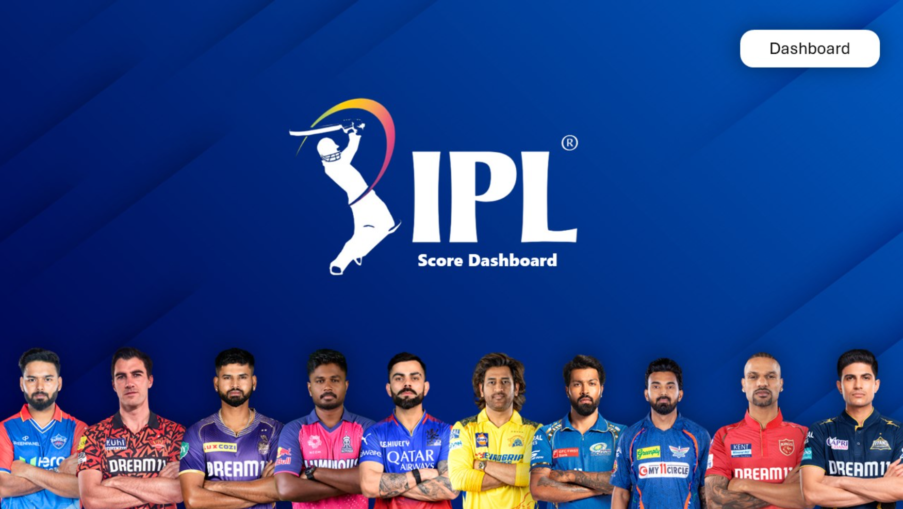
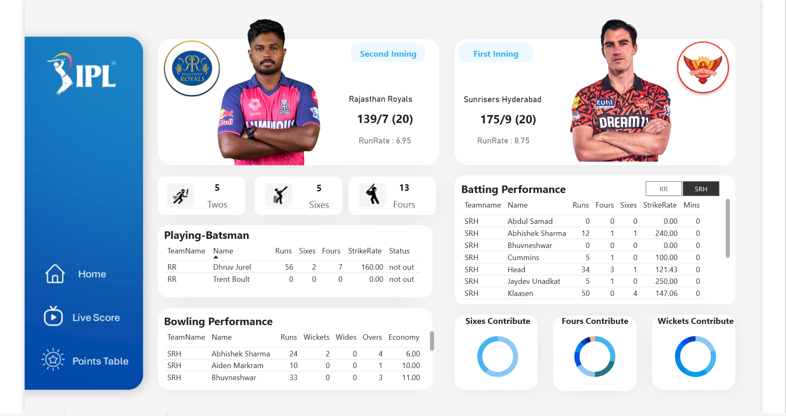
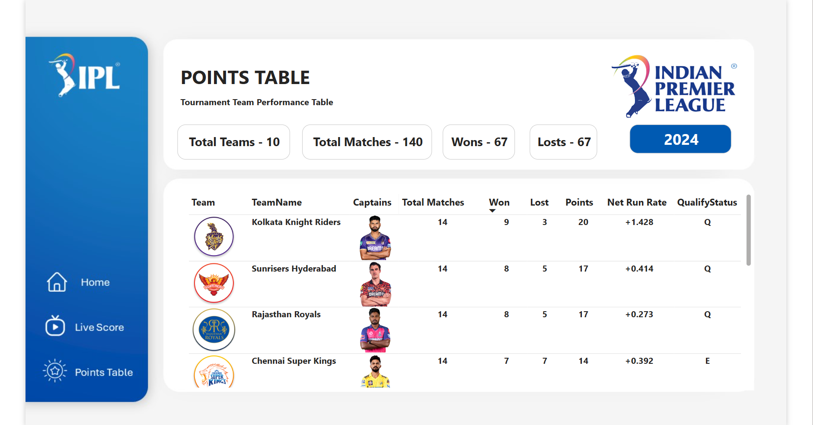

#  Live IPL Dashboard 
## Overview

This project involves the creation of a live IPL (Indian Premier League) dashboard using Power BI. The dashboard integrates real-time data through API calls and offers various interactive features and visualizations to provide insights into the IPL season.

## Screenshots

## Features

- **Real-Time Data Integration**: Fetches the latest IPL data using API calls.
- **Data Transformation**: Utilizes Power Query Editor for data cleaning and transformation.
- **Dynamic Visualizations**: Displays key metrics and trends with interactive charts and graphs.
- **DAX Calculations**: Implements DAX (Data Analysis Expressions) for creating calculated columns and measures.
- **User Interactivity**: Includes tooltips, images, multiple pages, and buttons for enhanced user experience.

## Skills Utilized

- Power BI
- API Integration
- Power Query Editor
- DAX (Data Analysis Expressions)
- Data Visualization
- Interactive Dashboard Design

### Usage

- Open the dashboard in Power BI Desktop.
- Navigate through different pages using the buttons provided.
- Interact with the visuals to explore various aspects of the IPL data.
- Use slicers and filters to customize the data views as per your requirements.

## Dashboard Highlights

- **Home Page**: Overview of key metrics such as top run-scorers, wicket-takers, and team standings.
- **Team Performance**: Detailed performance metrics for each team.
- **Player Stats**: In-depth statistics for individual players.
- **Match Analysis**: Insights into individual matches, including scorecards and performance analysis.

[Dashboard Link](https://app.powerbi.com/view?r=eyJrIjoiZTNjMWUxMWUtM2U3NS00ZGUyLWFhMTctYjZhNWZlNGFlOGI4IiwidCI6IjM1MWJiYTBmLTBhYWQtNDYzZC05ZjM3LTJlZThkZmZiMGIwMCJ9)

[API link](https://rapidapi.com/cricketapilive/api/cricbuzz-cricket)

